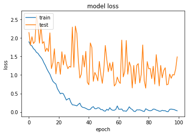

<h1 align="center">
  <br>
  Audio Analyser
  <br>
</h1>

<h3 align="center">Visit Website: <a href=""> Link</a></h3>
&nbsp;&nbsp;&nbsp;&nbsp;&nbsp;&nbsp;&nbsp;&nbsp;&nbsp;&nbsp;&nbsp;&nbsp;&nbsp;&nbsp;&nbsp;&nbsp;&nbsp;&nbsp;&nbsp;&nbsp;&nbsp;&nbsp;&nbsp;&nbsp;&nbsp;&nbsp;&nbsp;&nbsp;&nbsp;&nbsp;&nbsp;&nbsp;&nbsp;&nbsp;&nbsp;&nbsp;&nbsp;&nbsp;&nbsp;&nbsp;


[](https://github.com/Akriti0100/Antidote/blob/main/LICENSE)


<div align="justify">

>Audio Analyser is a project which helps people of different domains in different ways.
>It basically provides us with various graphs to internpret how the audio is and what are its features furthermore it tells us about the emotion of the speaker.
> It tells weather the speaker is a male or a female and tells about the speaker emotion.
</div>


<p align="center">
  <a href="#key-features">Key Features</a> •
  <a href="#ml-models-used">ML Models</a> •
  <a href="#how-to-use">How To Use</a> •
  <a href="#license">License</a>
</p>

<div align="justify">
  
## Key Features

* Graphs 
  * The user can input a audio of wav format and then get the graphs accordingly There are three types of graph.
    * Amplitude Time Graph
    * Spectogram
    * Amplitude Silence Time Graph
* Emotion and Gender Detector
    * The audio input is used to predict the gender of the speaker
    * The input is also used to tell the emotion with which the speaker is speaking.
</div>

<div align="justify">
  
## ML Models

* CNN (Convolutional Neural Network)
  * CNN is a type of artificial neural network, which is widely used for image/object recognition and classification.
  * MFCC Feature was extracted from `librosa` library and then fed to the CNN Model.
  * `Noise` was added to the data and `Pitch Tuning` was done for the data to get better results.
  * The dataset was then combined and fed to the CNN Model.
  * It gave an accuracy of `83.06%`.

The figure shows the model Loss during training  

</div>


<div align="justify">
  
## How to Use
The steps involved to run the application are:<br>
*You must have git and python installed on your machine*
1. Clone the repository.
2. Create a Virtual Environment using following commands
  ```bash
pip install virtualenv
virtualenv venv
```
3. Install the dependencies from `requirements.txt`
```bash
pip install -r requirements.txt
```
4. Run the server using the following command:
```bash
python manage.py runserver
```
**To make any changes in the project,Create a issue and then a pull request for that issue**

</div>


<div align="justify">
 
## License
 
`Audio Analyser` is free and open-source software licensed under the GPL-3.0 License.

</div>
